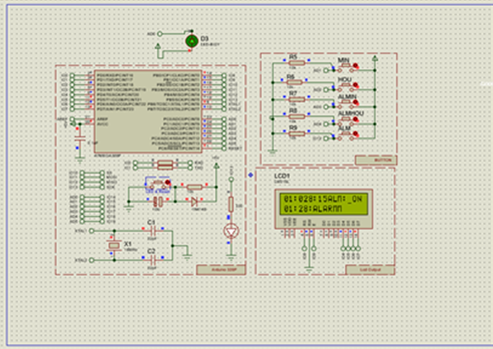

# Alarm Clock (ATmega328P)

A full digital alarm clock: Timer1 software real-time clock (no RTC chip), HH:MM:SS + alarm status on a 16x2 LCD, five push buttons for setting the clock/alarm and toggling the alarm on/off, a buzzer on match, and an IR-sensor-triggered backlight.

Also published as its own standalone repo with the full real-hardware writeup: [PRJ-FW-4001-2020-ArduinoAVRAlarmClock](https://github.com/hiibrarahmad/PRJ-FW-4001-2020-ArduinoAVRAlarmClock).

